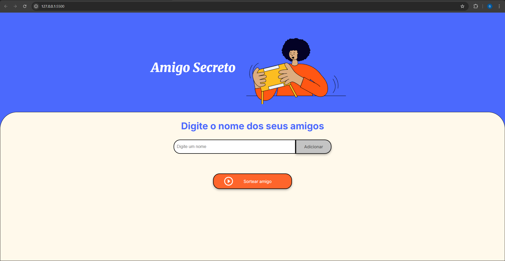

# 🎁 Amigo Secreto



Um projeto simples em HTML, CSS e JavaScript para adicionar nomes de amigos, exibi-los em uma lista e sortear aleatoriamente um deles.

## 🚀 Funcionalidades

- Adicionar nomes de amigos a uma lista.
- Evitar que nomes vazios sejam adicionados.
- Exibir todos os amigos adicionados.
- Sortear um amigo aleatoriamente.
- Após o sorteio, mostrar apenas o nome sorteado e limpar a lista.

## 📂 Estrutura de Arquivos

├── index.html # Estrutura principal do projeto
├── style.css # Estilos da página
├── app.js # Lógica em JavaScript
└── assets/ # Imagens e ícones usados

## 💻 Tecnologias Utilizadas

- HTML5
- CSS3
- JavaScript

## 🛠 Como Usar

1. Clone o repositório usando SSH:
   ```bash
   git clone git@github.com:Giscelmo/amigo-secreto.git
   ```
2. Abra o arquivo index.html no navegador.

3. Digite um nome no campo de entrada e clique em Adicionar.

4. Repita o processo para todos os amigos que deseja adicionar.

5. Clique no botão Sortear amigo para exibir o nome sorteado e limpar a lista.
